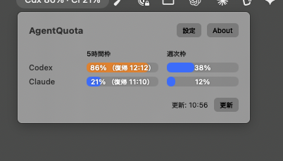

# AgentQuota

AgentQuota is a small native macOS menu bar app for monitoring Codex and Claude Code quota usage.



## Features

- Menu bar summary such as `Cdx 86% · Cl 21%`.
- Hover details for both the 5-hour and 7-day windows.
- Compact table with progress bars for Codex and Claude Code.
- Claude Code statusline integration that preserves your existing statusline command through a wrapper.
- Select which Claude Code quota windows to display: 5-hour and/or 7-day.
- Settings and About in one window with a sidebar.
- Japanese and English UI, plus a system-language option.
- Optional launch at login.
- Warning icon when a quota reaches 90%.

## Privacy and security

- Codex usage is read through the official `codex app-server` `account/rateLimits/read` method.
- Claude Code usage comes only from the JSON input provided to its official statusline command.
- The Claude integration stores only quota percentages and reset times locally in `~/Library/Application Support/AgentQuota/`.
- AgentQuota does not access Keychain, OAuth tokens, or unofficial Claude usage APIs.
- There is no telemetry, login screen, or automatic network service.

When an existing Claude Code statusline command is configured, AgentQuota stores it and passes the same input to both the wrapper and the original command. Your existing statusline output can therefore continue to work.

## Requirements

- macOS 14 or later
- Xcode or the Swift toolchain
- `codex` for Codex usage
- Claude Code 2.1.277 or later for the statusline rate-limit input

## Run from source

```sh
swift run AgentQuota
```

To use Xcode's toolchain for the current shell:

```sh
DEVELOPER_DIR=/Applications/Xcode.app/Contents/Developer swift run AgentQuota
```

## Claude Code integration

Open **Settings → Claude Code integration** and choose the quota windows you want. If you already have a statusline command, leave it in the command field and choose **Connect existing statusline**. AgentQuota creates a wrapper so the original command receives the same JSON input.

The Claude Code statusline is the supported data bridge; AgentQuota does not use private usage endpoints or credentials.

## Build a DMG

```sh
./scripts/package_dmg.sh 0.2.0
```

The DMG is created at `dist/AgentQuota-0.2.0.dmg`. The app is ad-hoc signed and is not notarized by Apple.

## License

This project is currently distributed without a separate license file.

日本語版: [README_ja.md](README_ja.md)
